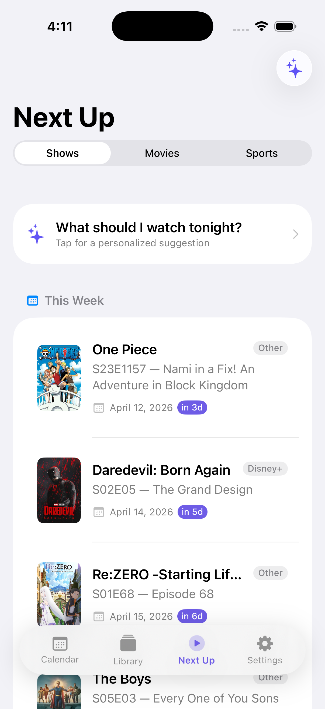
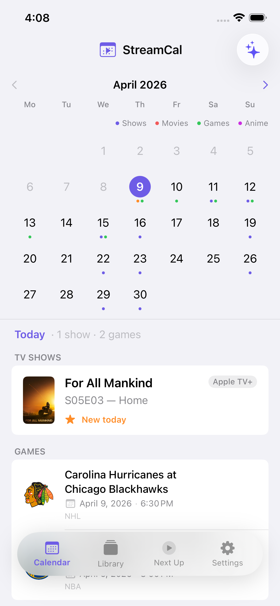
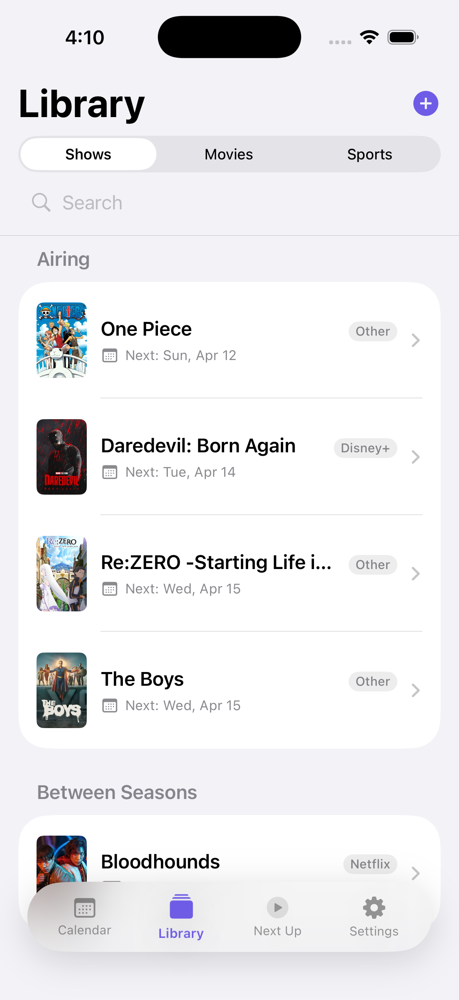
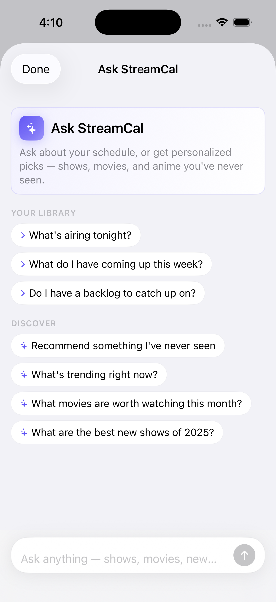

# StreamCal

**One calendar for every show, movie, anime and sports team you follow.**

Native iOS · SwiftUI · SwiftData · Claude

<p>
  
  
  
  
</p>

## Why

Streaming is fragmented. The show you're watching is on one app, the game is on another, and the anime you follow drops on a schedule nobody remembers. StreamCal pulls all of it into one place so you always know what's on next.

## What it does

- **Calendar and Next Up** show upcoming episodes, releases and games in one feed
- **Library** for shows, movies and sports, with search across TMDB, AniList and ESPN
- **Ask StreamCal**, an AI assistant that knows your library. Ask what's airing tonight or get picks you haven't seen
- **Watch planner** for tonight, tomorrow and the weekend, plus your backlog
- **Notifications** on air day, an advance reminder and a weekly summary
- **Trakt sync** for watch history, and links out to 16 streaming services
- **StreamCal Pro** subscription through RevenueCat

## Design decisions

- **All native.** No third party UI frameworks. Everything is SwiftUI with a small design token file (`DesignSystem.swift`).
- **Floating tab bar** in `.ultraThinMaterial` with a spring animation and a light haptic on every switch.
- **Tabs never lose their place.** All four tabs stay alive and switch by opacity, so scroll position and state survive.
- **AI answers render as UI, not a wall of text.** The assistant returns structured JSON that turns into sections and poster cards.
- **Sports that just work.** ESPN regular season and playoff schedules get merged so your team never disappears in April.
- **Posters load fast** through a shared image cache.

## Team

Built as a three person product team. I was lead iOS developer. Mireya ran UX research and IA, and MJ owned visual design in Figma.

## Run it

1. Open `StreamCal.xcodeproj` in Xcode (iOS 17+)
2. Create `StreamCal/APIKeys.swift` (gitignored) with your TMDB token:
   ```swift
   enum APIKeys { static let tmdbBearerToken = "YOUR_TOKEN" }
   ```
3. Build and run the StreamCal scheme

The AI assistant runs through a Cloudflare Worker in `worker/` that needs `ANTHROPIC_API_KEY` and `REVENUECAT_SECRET_KEY`.

## Stack

SwiftUI, SwiftData, RevenueCat, TMDB, ESPN, AniList, TheSportsDB, Trakt, Claude via Cloudflare Workers.
